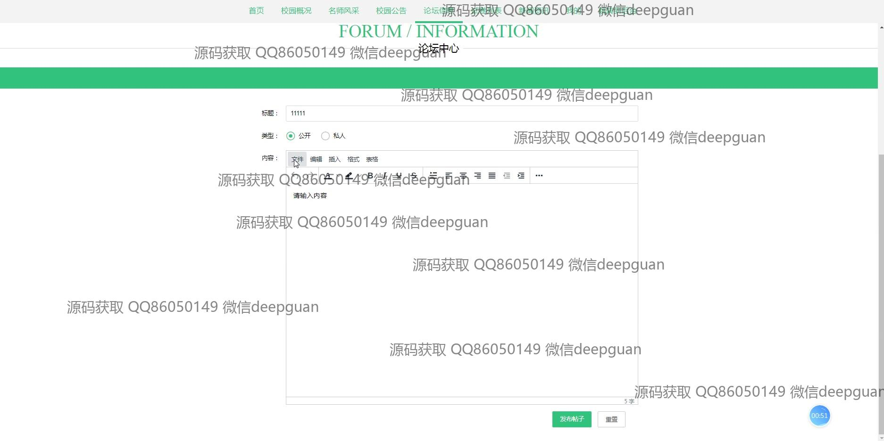
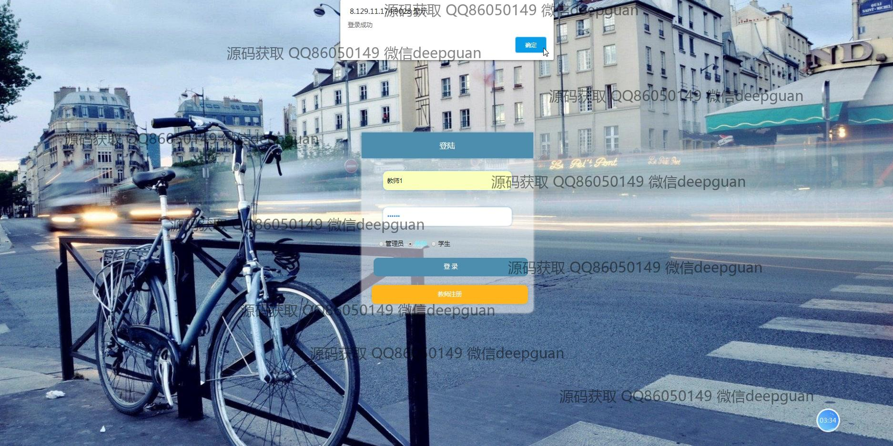
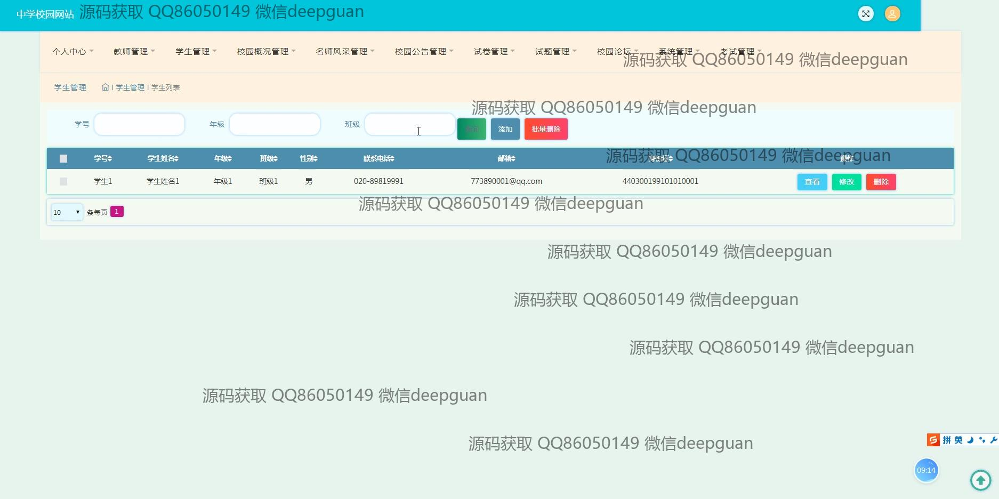

<h1 align="center">的中学校园网站-试卷考试</h1>

## 简介
中学校园网站包括校园公告、考试管理、论坛信息、学生和教师信息编辑，提供用户注册、登录、多种管理模块，支持试卷编辑、公告管理、在线考试及互动功能，提升师生校园信息化体验。    --计算机毕业设计源码；毕设源码；java毕业设计源码

## 联系方式

<h3 align="center">获取完整代码与数据库文件 + 微信：deepguan QQ: 86050149 QQ群: 783742310</h3>

<h3 align="center">可帮忙远程部署 包运行成功！提供远程部署、修改代码、设计文档指导、代码讲解等服务！</h3>

## 功能介绍（完整见运行截图）
管理员：登录注册界面提供身份选择，通过管理页面可以编辑公告、管理教师和学生信息、设置试卷和考试安排。涵盖公告管理、系统管理、校园论坛和试题管理等模块，支持公告发布、教师学生档案更新和试卷编辑功能，支持批量操作和搜索，提升数据管理效率。

教师：通过登录获取访问权限，支持公告查看与发布。管理页面允许教师编辑个人档案和试题信息，参与校园论坛讨论并对讨论内容进行管理。提供便捷的试卷和考试信息编辑界面以及资源共享与上传功能，支持考试记录维护和成绩查看。

学生：登录进入平台后，可查看公告和参与论坛互动。考试模块提供题目答题和解析查看功能，支持答题进度显示和时间管理。提供个人信息编辑和资料管理功能，支持考试状态追踪和历史考试记录查看，提升学习交互体验。

访客：通过校园概况页面了解校园信息，浏览公告和校园新闻。论坛页面允许浏览帖子但需要注册后方可参与互动。提供P的导航指引和模块展示，简化信息获取流程，促进校园文化和公告快速传播。

## 运行截图

本代码来源于网络,仅供学习参考使用!

